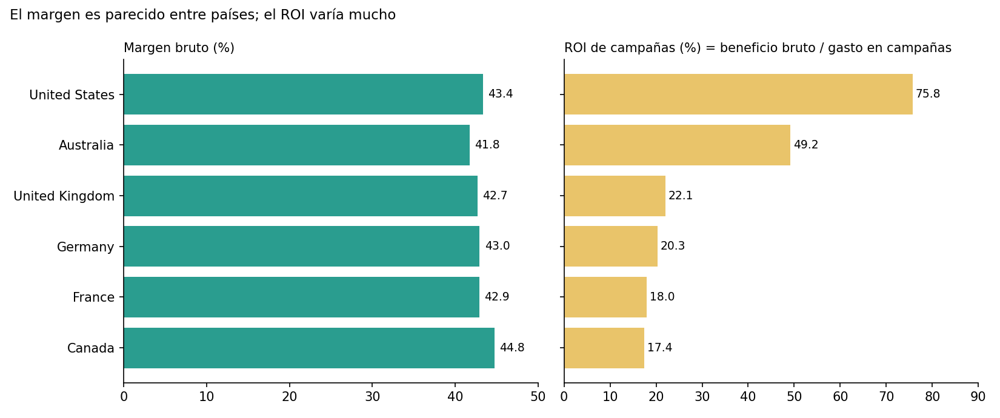
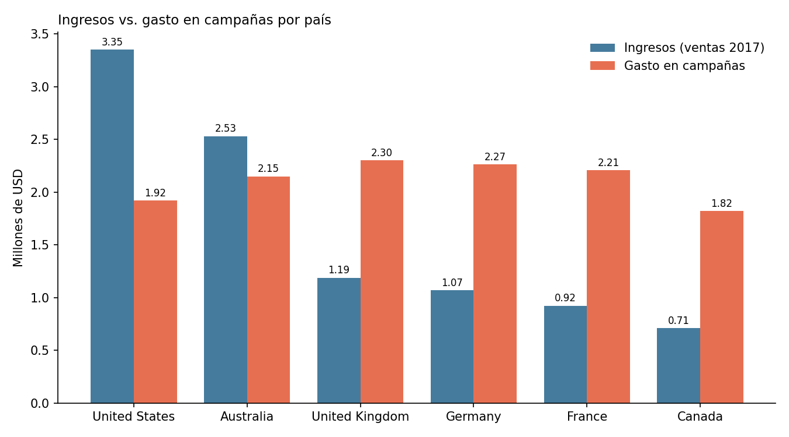

# 💰 Rentabilidad financiera por país con SQL (AdventureWorks)


> Análisis con SQL de los ingresos, costos, margen y ROI de campañas por país, para orientar dónde conviene invertir el presupuesto de marketing.
>
> Proyecto del Bootcamp de Análisis de Datos de TripleTen sobre un subconjunto del dataset de ejemplo AdventureWorks. El escenario (un director financiero que decide dónde invertir el próximo dólar de marketing) es simulado.

**Resultado en una línea:** el margen bruto es muy parecido entre los seis países (41.8%–44.8%), pero el ROI de campañas varía de 17% a 76%. Como el gasto en campañas es similar en todos los países y las ventas no, el ROI sigue casi exactamente el tamaño de ventas de cada mercado. Además, en cuatro de los seis países el gasto en campañas supera a los ingresos, un dato que conviene verificar antes de sacar conclusiones de inversión.

---

## 📑 Tabla de contenido

**Sección técnica**
- [Objetivo](#-objetivo)
- [Datos](#-datos)
- [Tecnologías](#-tecnologías)
- [Metodología](#-metodología)
- [Consultas SQL](#-consultas-sql)
- [Definición de los KPIs](#-definición-de-los-kpis)
- [Limitaciones](#-limitaciones)
- [Estructura del repositorio](#-estructura-del-repositorio)

**Sección de negocio**
- [Contexto y preguntas](#-contexto-y-preguntas)
- [Resultados](#-resultados)
- [Hallazgos clave](#-hallazgos-clave)
- [Recomendaciones](#-recomendaciones)

---

## 🧭 SECCIÓN TÉCNICA

### 🎯 Objetivo

Combinar ventas, productos, categorías, territorios y campañas en una tabla base limpia, y calcular por país los indicadores financieros clave: ingresos, costos, beneficio bruto, margen y ROI de campañas.

### 🗂️ Datos

Subconjunto de **AdventureWorks** alojado en la plataforma del bootcamp: `ventas_2017`, `productos`, `productos_categorias`, `clientes`, `territorios` y `campanas`. Las tablas no se pueden exportar, por lo que **no se incluyen aquí**. El detalle está en [`data/README.md`](data/README.md).

Sí se incluyen los resultados finales por país: [`data/kpis_por_pais.csv`](data/kpis_por_pais.csv).

### ⚙️ Tecnologías

- **Lenguaje:** SQL con sintaxis de PostgreSQL (`::integer`, `NULLIF`, `COALESCE`)
- **Resumen y gráficos:** hoja de cálculo y Python (Matplotlib) a partir de los resultados

### 🔬 Metodología

1. **Explorar el esquema:** revisar las tablas e identificar las claves de unión (`clave_producto`, `clave_territorio`, `clave_subcategoria`).
2. **Extraer y limpiar:** construir la tabla base `ventas_clean` uniendo ventas, productos, categorías y territorios. Se usa `COALESCE` para tratar los nulos como cero y `LEFT JOIN` para no perder ventas si falta una categoría o un territorio.
3. **Calcular los KPIs:** agregar por país y territorio, con `NULLIF` para evitar divisiones por cero.
4. **Validar (QA):** comprobar precios no válidos y proponer verificaciones de totales y de duplicación de filas.
5. **Comunicar:** resumen ejecutivo con el método Contexto → Hallazgo → Implicación.

### 🧾 Consultas SQL

| Archivo | Qué hace |
| --- | --- |
| [`sql/01_explorar_esquema.sql`](sql/01_explorar_esquema.sql) | Exploración de las tablas |
| [`sql/02_ventas_clean.sql`](sql/02_ventas_clean.sql) | Tabla base con `ingreso_total` y `costo_total` por línea de pedido |
| [`sql/03_kpis_por_pais.sql`](sql/03_kpis_por_pais.sql) | KPIs por país: ingresos, costos, campañas, beneficio bruto, margen y ROI |
| [`sql/04_qa_validaciones.sql`](sql/04_qa_validaciones.sql) | Controles de calidad |

Fragmento representativo, el cálculo de los KPIs:

```sql
SELECT
    p.pais,
    p.clave_territorio,
    SUM(p.ingresos)::integer AS ingresos,
    SUM(p.costos)::integer AS costos,
    COALESCE(SUM(c.costo_campana), 0)::integer AS costo_campana,
    ((SUM(p.ingresos) - SUM(p.costos)) * 100.0)
        / NULLIF(SUM(p.ingresos), 0) AS margen_pct,
    ((SUM(p.ingresos) - SUM(p.costos)) * 100.0)
        / NULLIF(SUM(c.costo_campana), 0) AS roi_pct
FROM pais_ingreso_costo AS p
LEFT JOIN pais_campanas AS c
    ON p.clave_territorio = c.clave_territorio
GROUP BY p.pais, p.clave_territorio;
```

> **Alcance del código:** este repositorio conserva las consultas principales del análisis. El código de las vistas intermedias `pais_ingreso_costo` y `pais_campanas`, y de varias consultas de exploración, no se pudo recuperar de la plataforma. Por eso las consultas **no se pueden ejecutar de principio a fin** fuera de ella.

### 📐 Definición de los KPIs

| KPI | Fórmula | Nota |
| --- | --- | --- |
| Ingresos | Σ precio × cantidad | |
| Costos | Σ costo unitario × cantidad | Costo del producto vendido |
| Beneficio bruto | Ingresos − Costos | **No descuenta** el gasto en campañas |
| Margen (%) | Beneficio bruto ÷ Ingresos × 100 | |
| ROI de campañas (%) | Beneficio bruto ÷ Gasto en campañas × 100 | Beneficio bruto generado por cada dólar de campañas |

Esta definición de ROI es la que usa el proyecto. Tiene una consecuencia importante: **no es un ROI neto**. Si se restara el gasto en campañas del beneficio bruto, el resultado sería negativo en los seis países (por ejemplo, −0.47 M USD en Estados Unidos). Se explica en detalle en las limitaciones.

### ⚠️ Limitaciones

- **El ROI no es neto.** El numerador no descuenta el gasto de campañas. Sirve para comparar mercados entre sí, no para afirmar que las campañas sean rentables.
- **El gasto en campañas supera a los ingresos en 4 de 6 países** (Reino Unido, Alemania, Francia y Canadá; entre 1.9 y 2.6 veces los ingresos). Puede ser real, o indicar que el gasto cubre un periodo o un alcance distinto de las ventas de 2017. Conviene verificarlo antes de tomar decisiones.
- **Un solo año y una sola foto:** con datos de un año no se puede hablar de tendencias, saturación ni rendimientos decrecientes.
- **Posible duplicación por el `LEFT JOIN`:** si `pais_campanas` tuviera varias filas por territorio, los ingresos y costos se multiplicarían. Las verificaciones sugeridas están en `sql/04_qa_validaciones.sql`.
- **Fila de Estados Unidos:** la consulta agrupa por país y territorio, y el resumen muestra una sola fila para Estados Unidos (`clave_territorio` = 1). No queda documentado si esa fila cubre todo el país.
- **Cifras enteras frente a decimales:** la consulta guardada convierte a entero (`::integer`), mientras que el resumen conserva decimales; se usan estas últimas.
- **No se midió el costo de adquisición de clientes**, por lo que no se puede atribuir la diferencia de ROI a la eficiencia de las campañas.

### 🗃️ Estructura del repositorio

```
rentabilidad-financiera-sql-adventureworks/
├── README.md
├── LICENSE
├── sql/
│   ├── 01_explorar_esquema.sql
│   ├── 02_ventas_clean.sql
│   ├── 03_kpis_por_pais.sql
│   └── 04_qa_validaciones.sql
├── data/
│   ├── README.md                ← tablas de origen y diccionario
│   └── kpis_por_pais.csv        ← resultados finales
└── images/                      ← gráficos usados en este README
```

---

## 💼 SECCIÓN DE NEGOCIO

### 🏢 Contexto y preguntas

El director financiero de AdventureWorks (escenario simulado) quiere decidir dónde invertir el próximo dólar de marketing y busca responder:

1. **¿Cuánto estamos ganando por país?**
2. **¿Qué tan rentable es cada mercado considerando los gastos de marketing?**

### 📊 Resultados

| País | Ingresos | Costos | Gasto en campañas | Beneficio bruto | Margen | ROI |
| --- | ---: | ---: | ---: | ---: | ---: | ---: |
| Estados Unidos | 3,353,940 | 1,899,471 | 1,920,000 | 1,454,469 | 43.37% | 75.75% |
| Australia | 2,532,003 | 1,474,958 | 2,150,400 | 1,057,045 | 41.75% | 49.16% |
| Reino Unido | 1,189,637 | 681,509 | 2,304,000 | 508,128 | 42.71% | 22.05% |
| Alemania | 1,071,460 | 611,295 | 2,265,600 | 460,165 | 42.95% | 20.31% |
| Francia | 924,317 | 527,797 | 2,208,000 | 396,520 | 42.90% | 17.96% |
| Canadá | 710,205 | 392,326 | 1,824,000 | 317,879 | 44.76% | 17.43% |

Cifras en USD, redondeadas. Los valores exactos están en [`data/kpis_por_pais.csv`](data/kpis_por_pais.csv).

**El margen es parecido entre países, pero el ROI no:**



**El gasto en campañas es similar entre países; los ingresos no:**



### 💡 Hallazgos clave

- **Estados Unidos lidera** en ingresos (3.35 M USD), beneficio bruto (1.45 M USD) y ROI (75.75%).
- **La rentabilidad del producto es homogénea:** el margen bruto se mueve en un rango estrecho (41.75%–44.76%), y Canadá tiene incluso el margen más alto. Las diferencias entre países no vienen de los costos de producto.
- **El ROI depende sobre todo del tamaño de ventas.** El gasto en campañas va de 1.82 a 2.30 M USD, mientras que los ingresos varían casi 5 veces (de 0.71 a 3.35 M USD). El ranking de ROI coincide exactamente con el de ingresos (correlación de 0.99 entre ambos). Con estos datos no se puede separar la eficiencia de las campañas del tamaño del mercado.
- **En Reino Unido, Alemania, Francia y Canadá el gasto en campañas supera al ingreso total** (entre 1.9 y 2.6 veces), lo que hace su ROI bajo y merece verificación de los datos.
- **Sensibilidad simple:** si el gasto en campañas subiera un 50% sin aumentar el beneficio bruto, el ROI caería un tercio (por ejemplo, de 75.75% a 50.5% en Estados Unidos). Para mantener el ROI, el beneficio bruto tendría que crecer también un 50%.

### ✅ Recomendaciones

1. **Verificar la cobertura del gasto en campañas** (periodo, territorios y unidades) frente a las ventas de 2017, sobre todo en los cuatro países donde supera los ingresos.
2. **Calcular un ROI neto** (beneficio bruto menos gasto en campañas, dividido por el gasto) y compararlo con el ROI actual.
3. **Comparar el ROI por categoría de producto y por periodo** para separar el efecto del tamaño del mercado del de la eficiencia de las campañas. La tabla base ya incluye la categoría.
4. **No mover presupuesto entre países solo con estos datos.** El ROI calculado es un promedio del año: no dice qué pasaría si se gasta más o menos en un país, ni cómo responden las ventas a la inversión.

---

## 👤 Autor

**Daniel Medina Guzmán** · Analista de Datos
[LinkedIn](https://www.linkedin.com/in/danielmg-data) · [GitHub](https://github.com/danielmg-data) · medinaguzman.da@gmail.com
